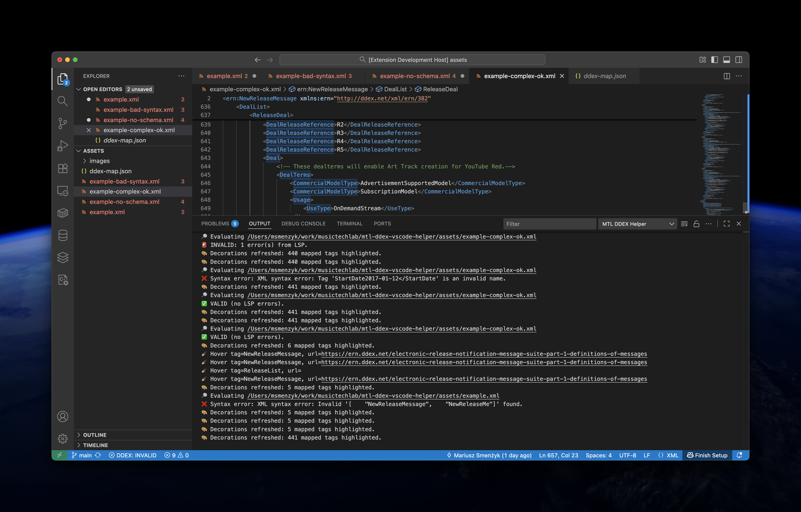

# 🎵 MTL DDEX Helper

[](https://marketplace.visualstudio.com/items?itemName=musictechlab.mtl-ddex-vscode-helper)
[](https://marketplace.visualstudio.com/items?itemName=musictechlab.mtl-ddex-vscode-helper)
[](https://marketplace.visualstudio.com/items?itemName=musictechlab.mtl-ddex-vscode-helper)

**MTL DDEX Helper** is a VS Code extension that makes working with **DDEX XML metadata** (ERN, MWDR, MLC, Party ID, etc.) faster and easier.  
It integrates directly with the **Red Hat XML** language server to provide **live XSD validation**, documentation hovers, and schema helpers.



**[Install from VS Code Marketplace](https://marketplace.visualstudio.com/items?itemName=musictechlab.mtl-ddex-vscode-helper)**

---

## ✨ Features

- 🔗 **Jump to documentation** — place your cursor on any XML tag (e.g. `<PartyId>`) and press `Ctrl + Alt + D` to open the official DDEX documentation.  
- ⚙️ **Namespace aware** — works even with prefixed tags like `<ern:ReleaseList>`.  
- 📘 **Live schema validation** — uses Red Hat XML LSP to validate your DDEX XML in real time.  
- 🧩 **Auto schema association** — run `MTL DDEX: Associate ERN Schema` to link the correct ERN XSD version (e.g. 3.8.2).  
- 📁 **Customizable tag map** — edit `assets/ddex-map.json` to define tag-to-documentation URLs.  
- 🪶 **Lightweight & portable** — no native dependencies, works cross-platform.

---

### Example

```xml
<NewReleaseMessage
  xmlns:ern="http://ddex.net/xml/ern/382"
  xmlns:xsi="http://www.w3.org/2001/XMLSchema-instance"
  xsi:schemaLocation="http://ddex.net/xml/ern/382 http://ddex.net/xml/ern/382/release-notification.xsd">
  <ReleaseList>
    <Release>
      <DisplayArtist>John Doe</DisplayArtist>
    </Release>
  </ReleaseList>
</NewReleaseMessage>
```

➡️ Place your cursor on `<ReleaseList>` → press **Ctrl + Alt + D** → browser opens  
the [ReleaseList documentation](https://support.google.com/youtube/answer/3506114).

---

## 🧩 Requirements

- **Visual Studio Code 1.80+**
- **Red Hat XML** extension (`redhat.vscode-xml`)  
  → automatically installed if missing
- **Node.js 18+** (for local development)

---

## ⚙️ Commands

| Command | Description |
|----------|--------------|
| `MTL DDEX: Open Docs for Tag` | Opens documentation link for current XML tag |
| `MTL DDEX: Reload DDEX Map` | Reloads tag-to-doc mapping from `assets/ddex-map.json` |
| `MTL DDEX: Associate ERN Schema` | Detects ERN version and sets VS Code XML file associations |

---

## 🧠 Validation Workflow

1. **Syntax check** — fast well-formedness validation using `fast-xml-parser`.  
2. **Schema check** — handled by **Red Hat XML**, using either:  
   - `xsi:schemaLocation` in your XML, or  
   - workspace-level `xml.fileAssociations` set via the *Associate ERN Schema* command.  
3. **Status bar indicator** — shows ✅ VALID or ❌ INVALID based on current diagnostics.

---

## 🧾 Release Notes

### 0.2.0 (2025-10-23)
- Integrated Red Hat XML for real-time schema validation  
- Added DDEX VALID/INVALID status indicator  
- Added `Associate ERN Schema` command  
- Removed native xmllint/xsd dependencies  
- Improved logging and tag decorations

### 0.0.1 (initial)
- Initial prototype with tag-to-documentation map

---

## 🧱 Roadmap

- 🔜 Hover tooltips with tag descriptions from DDEX docs  
- 🔜 CodeLens: “Open Docs” above tag definitions  
- 🔜 Auto-completion for DDEX tags based on schema  
- 🔜 Export validation report (JSON/Markdown)

---

## 🐞 Known Issues

- Requires valid `schemaLocation` or associated schema for full validation.  
- Some ERN sub-schemas (e.g. `ern-common.xsd`) may require manual mapping in Red Hat XML settings.

---

## 📚 Learn More

- [DDEX Official Site](https://ddex.net)  
- [Red Hat XML Extension](https://marketplace.visualstudio.com/items?itemName=redhat.vscode-xml)  
- [VS Code Extension API](https://code.visualstudio.com/api)  
- [MusicTech Lab](https://musictechlab.io)

---

## 🪪 License

MIT License — © 2025 MusicTech Lab.  
Built with ❤️ by [MusicTech Lab](https://musictechlab.io).
